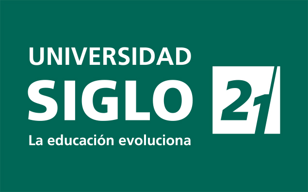

# Hi, I'm Matias Bussetti, _here is what you need to know_ 🌞

 

I'm a **Full Stack Developer** based in the province of Buenos Aires, Argentina. I'm currently working in _Bahia Domotica_ in a **Full Stack Developer role**. I have **3+ years of experience** working and developing solutions independently and managing assigned tasks. I also work with my own clients, who have been satisfied with the results delivered.

I'm currently **studying a bachelor's degree in computer science** at University Siglo 21. I also hold three _technical degrees_: _Personal and Professional IT Technician_ (High-School), _Technical Degree in Web Application Development_ (UPSO university), _University Technical Degree in Programming_ (UTN university).

---

## 💼 Professional Experience

### **Full Stack Developer**

**Bahía Domótica, Bahía Blanca, Buenos Aires (Remote)**  
_Sep 2023 – Present_

- Develop and implement new user interfaces for the home automation system control application, focused on improving end-user experience.
- Design and maintain full stack features using **PHP** for backend and **React.js** for frontend.
- Integrate APIs and services to enable communication between the application and home automation devices.
- Maintain clean, scalable architecture with a strong focus on code quality and maintainability.
- Optimize application performance and usability in critical system interfaces.

### **Freelance Full Stack Developer**

_2020 – Present_

- **GabiBianchiFitCoach**: Designed and implemented a web application that provides improved client management for minimizing manual errors.
- 🔗 https://www.gabibianchifitcoach.com.ar
- Work with clients to gather requirements, propose technical solutions, and deliver maintainable applications.
- Handle full project lifecycle, from initial analysis and development to deployment and maintenance.

---

## ⛳ My Knowledge

 

---

## 🧮 Academic Achievements

| Degree                                              | Start Year | Graduation Year | Institution                                 | Institution Logo                                                                                     |
| --------------------------------------------------- | ---------- | --------------- | ------------------------------------------- | ---------------------------------------------------------------------------------------------------- |
| **Computer Science Degree**                         | 2025       | Ongoing         | Universidad Siglo 21                        |  |
| University Technical in Programming                 | 2023       | 2024            | Universidad Tecnológica Nacional            |      |
| University Technical in Web Application Development | 2021       | 2023            | Universidad Provincial del Sudoeste         |              |
| Technical in Web Application Development            | 2012       | 2019            | Escuela de Educación Secundaria Técnica N°2 |           |

---

## 📫 Get in Touch

---

## ✨ Github Stats

 

 
 

