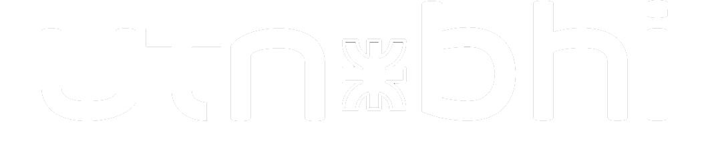

# Lo que necesitas saber

### Mi busqueda actual

Busco una posición donde pueda aplicar mis habilidades en desarrollo full-stack, con experiencia en React, PHP, APIs REST y bases de datos, para contribuir al desarrollo de soluciones innovadoras y eficientes, enfocado en la mejora continua, el aprendizaje de nuevas tecnologías y el trabajo en conjunto.

---

### Logros Académicos

| Título                                                      | Inicio | Graduación | Institución                                                                                      |
| ----------------------------------------------------------- | ------ | ---------- | ------------------------------------------------------------------------------------------------ |
| Tecnicatura Universitaria en Programación                   | 2023   | 2024       |  |
| Tecnicatura Universitaria en Desarrollo de Aplicaciones Web | 2021   | 2023       |          |
| Técnico en Informatica Personal y Profesional               | 2012   | 2019       |       |

---

## Conocimientos Técnicos generales

⚡ _Programación_

⚡ _Redes y Comunicaciones_

⚡ _Informatica_

## Programación: Conocimientos y Habilidades

#### Current Stack

 

#### Conocidos - Utilizados

#### Otras Herramientas

#### Sistemas Operativos

---

## Contacto:

 **me.bussettiruiz@gmail.com**

---

 

 
 

